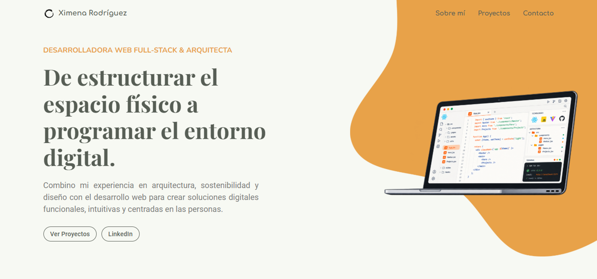
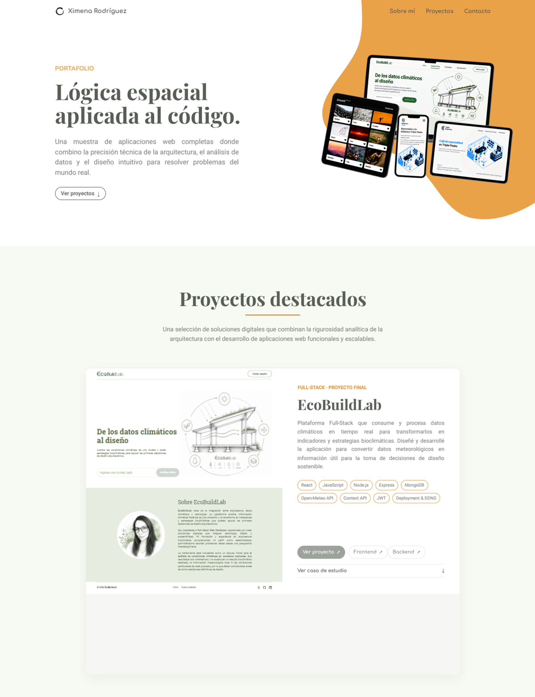
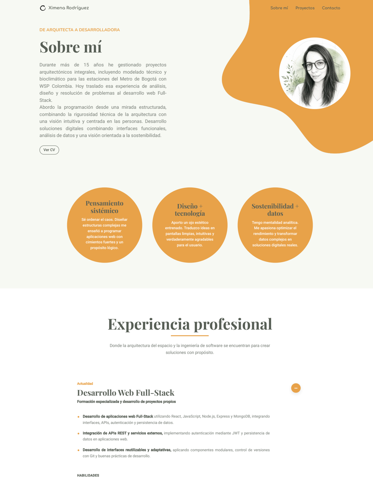

# Ximena Rodríguez — Portfolio

Portfolio personal de **Ximena Rodríguez**, Desarrolladora Web Full-Stack y Arquitecta.

Este sitio presenta mi transición de la arquitectura hacia el desarrollo web, integrando mi experiencia en arquitectura, sostenibilidad y gestión de proyectos con el desarrollo de soluciones digitales.

El portfolio reúne proyectos desarrollados durante mi formación en desarrollo web y proyectos propios, mostrando experiencia tanto en desarrollo Front-End como en aplicaciones Full-Stack.

## 🌐 Portfolio

[Visitar portfolio](https://ximena-rodriguez-portfolio.vercel.app/)

## ✨ Sobre el proyecto

Este portfolio fue desarrollado como un espacio para presentar mi perfil profesional, experiencia y proyectos de desarrollo web.

La estructura del sitio está enfocada en una navegación sencilla y una presentación visual que conecta mi experiencia previa en arquitectura con mi formación actual como desarrolladora web.

## 🛠️ Tecnologías

- React
- JavaScript
- HTML5
- CSS3
- React Router
- Git
- GitHub
- Vercel

## 📸 Preview

### Inicio



### Proyectos



### Sobre mí



## 🚀 Proyectos destacados

### EcoBuildLab

Aplicación web Full-Stack desarrollada para analizar condiciones climáticas y generar información útil para la toma de decisiones en diseño arquitectónico sostenible.

El proyecto integra datos climáticos, análisis mediante clasificación Caldas-Lang, visualización de información y estrategias bioclimáticas.

**Tecnologías:** React · JavaScript · Node.js · Express · MongoDB · Mongoose · REST API · JWT · Nginx · PM2

- **Demo:** [ecobuildlab.duckdns.org](https://ecobuildlab.duckdns.org/)
- **Frontend:** [GitHub](https://github.com/Ximerm/ecobuildlab-frontend)
- **Backend:** [GitHub](https://github.com/Ximerm/ecobuildlab-backend)

---

### Around the U.S.

Aplicación web Full-Stack desarrollada progresivamente durante varios sprints, desde una interfaz responsiva hasta una aplicación con React, API REST propia, base de datos y autenticación.

El proyecto incluye gestión de perfiles y tarjetas, likes, formularios, validación y rutas protegidas.

**Tecnologías:** React · JavaScript · Node.js · Express · MongoDB · Mongoose · REST API · JWT · Nginx · PM2

- **Demo:** [aroundxr.duckdns.org](https://aroundxr.duckdns.org/)
- **GitHub:** [Repositorio](https://github.com/Ximerm/web_project_api_full)

---

### Proyectos Front-End

Colección de proyectos desarrollados durante mi formación en desarrollo web, aplicando progresivamente HTML, CSS, JavaScript, diseño responsivo y buenas prácticas de organización del código.

Los proyectos fueron desarrollados a partir de diseños y briefs, trabajando con Flexbox, CSS Grid, BEM, media queries y Git.

**Proyectos:**

- [Library](https://github.com/Ximerm/web_project_library)
- [Coffee Shop](https://github.com/Ximerm/web_project_coffeeshop)
- [De patria a patria](https://github.com/Ximerm/web_project_homeland)

**Tecnologías:** HTML5 · CSS3 · JavaScript · BEM · Flexbox · CSS Grid · Responsive Design · Figma · Git · GitHub

## ✨ Características

- Diseño responsive adaptado a escritorio, tablet y dispositivos móviles.
- Navegación entre páginas mediante React Router.
- Componentes reutilizables para mantener una estructura modular.
- Información de proyectos, experiencia, educación, habilidades y contacto organizada mediante archivos de datos.
- Página de proyectos con información y enlaces independientes para cada proyecto.
- Enlace directo al CV en formato PDF.
- Integración de enlaces a GitHub, LinkedIn y correo electrónico.
- Identidad visual propia aplicada mediante componentes, tipografías, colores e imágenes.
- Diseño orientado a la presentación profesional del perfil y los proyectos de desarrollo web.

## 📁 Estructura del proyecto

```text
src/
├── assets/
│   ├── icons/
│   └── images/
│
├── components/
│   ├── About/
│   ├── Contact/
│   ├── Education/
│   ├── Experience/
│   ├── FeaturedProjects/
│   ├── Footer/
│   ├── Header/
│   ├── Hero/
│   ├── ProjectCard/
│   ├── Projects/
│   └── Skills/
│
├── data/
│   ├── contact.js
│   ├── education.js
│   ├── experience.js
│   ├── projects.js
│   └── skills.js
│
├── App.jsx
├── index.css
└── main.jsx
```

## 📱 Diseño responsive

El portfolio fue desarrollado considerando diferentes tamaños de pantalla y utiliza:

- CSS Grid
- Flexbox
- Media queries
- Diseño responsive
- Componentes adaptativos
- Variables CSS para mantener consistencia visual

La interfaz se adapta a diferentes dispositivos manteniendo una navegación y presentación clara del contenido.

## ⚙️ Instalación y ejecución

### 1. Clonar el repositorio

```bash
git clone https://github.com/Ximerm/ximena-rodriguez-portfolio.git
```

### 2. Entrar al proyecto

```bash
cd ximena-rodriguez-portfolio
```

### 3. Instalar las dependencias

```bash
npm install
```

### 4. Ejecutar el proyecto en desarrollo

```bash
npm run dev
```

La aplicación estará disponible en la dirección local indicada por Vite, normalmente:

```text
http://localhost:5173/
```

### 5. Generar la versión de producción

```bash
npm run build
```

### 6. Previsualizar la versión de producción

```bash
npm run preview
```

## 🌐 Despliegue

El portfolio se encuentra desplegado en producción:

[ximena-rodriguez-portfolio.vercel.app](https://ximena-rodriguez-portfolio.vercel.app/)

## 👩‍💻 Autora

**Ximena Rodríguez**

Desarrolladora Web Full-Stack y Arquitecta, con experiencia en arquitectura, sostenibilidad, gestión de proyectos y docencia.

Actualmente enfoco mi desarrollo profesional en la creación de aplicaciones web y soluciones digitales, combinando pensamiento analítico, experiencia interdisciplinaria y desarrollo tecnológico.

### Contacto

- **LinkedIn:** [linkedin.com/in/arqximenarm](https://www.linkedin.com/in/arqximenarm/)
- **GitHub:** [github.com/Ximerm](https://github.com/Ximerm)
- **Portfolio:** [ximena-rodriguez-portfolio.vercel.app](https://ximena-rodriguez-portfolio.vercel.app/)
- **Email:** [arq.xrm@gmail.com](mailto:arq.xrm@gmail.com)

---

© 2026 Ximena Rodríguez. Todos los derechos reservados.
